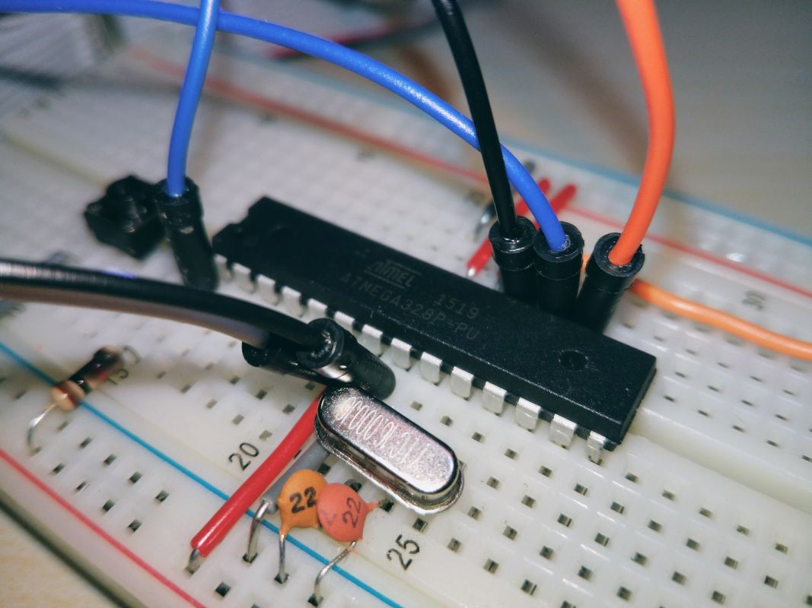
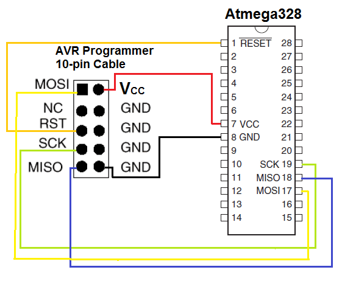

# AVR Assembly tests

I'm trying to increase my understanding of computers in general by getting closer to the metal and writing some assembly. I've got an ATmega328P (the MCU from an Arduino) on a breadboard, and a USBASP for programming it over a serial connection.



## Development

AVRA is the assembler I'm using, it's simple to run:

```
avra code.asm
```

This spits out a .hex file which can be written to the MCU using avrdude:

```
avrdude -c usbasp -p atmega328p -P /dev/ttyACM0 -U flash:w:code.hex
```

## Wiring

### MCU


### Programmer


